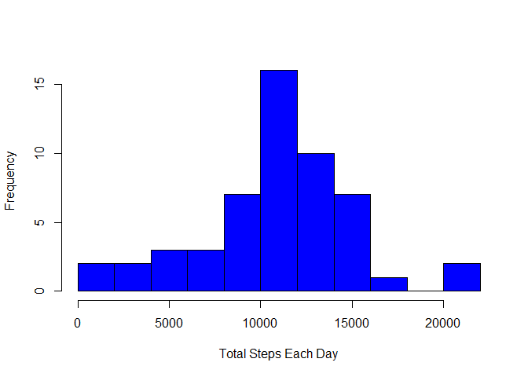
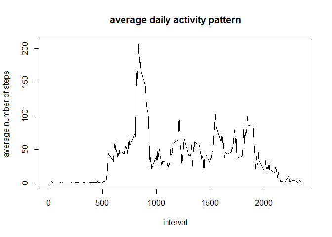
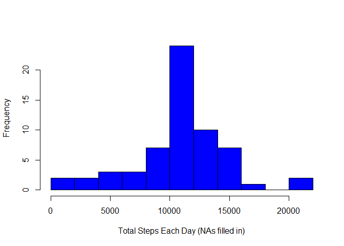
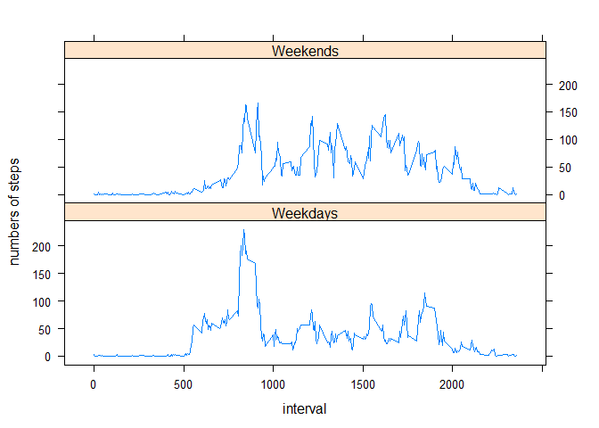

# Reproducible Research: Peer Assessment 1


## Loading and preprocessing the data
Load data using fread() from "data.table" package 

```r
library(data.table)
data <- fread("activity.csv", header=TRUE, sep=",")
```
Preprocess data:  
a.remove all NA value  
b. convert date column into date class

```r
complete <- complete.cases(data)
data_complete <- data[complete,]
class(data_complete)
```

```
## [1] "data.table" "data.frame"
```

```r
dim(data_complete)
```

```
## [1] 15264     3
```

## What is mean total number of steps taken per day?

1. Calculate the total number of steps taken per day

```r
## 1 Calculate the total number of steps taken per day
totalsteps <-data_complete[, sum(steps), by=date]
setnames(totalsteps, c("date", "steps"))
head(totalsteps)
```

```
##          date steps
## 1: 2012-10-02   126
## 2: 2012-10-03 11352
## 3: 2012-10-04 12116
## 4: 2012-10-05 13294
## 5: 2012-10-06 15420
## 6: 2012-10-07 11015
```

2. Make a histogram of the total number of steps taken each day

```r
hist(totalsteps$steps, xlab="Total Steps Each Day", main="", col="blue", breaks=15)
```

 

3. Calculate and report the mean and median of the total number of steps taken per day  

```r
mean(totalsteps$steps)
```

```
## [1] 10766.19
```

```r
median(totalsteps$steps)
```

```
## [1] 10765
```


## What is the average daily activity pattern?  

```r
interval <-data_complete[, mean(steps), by=interval]
setnames(interval, c("interval", "steps"))
head(interval)
```

```
##    interval     steps
## 1:        0 1.7169811
## 2:        5 0.3396226
## 3:       10 0.1320755
## 4:       15 0.1509434
## 5:       20 0.0754717
## 6:       25 2.0943396
```
Make a time series plot of the 5-minute interval (x-axis) and the average number of steps taken, averaged across all days (y-axis)  

```r
with(interval, plot(interval, steps, type="l", 
                    xlab="interval", 
                    ylab="average number of steps",
                    main="average daily activity pattern"))
```

 

Which 5-minute interval, on average across all the days in the dataset, contains the maximum number of steps?  

```r
subset(interval$interval, interval$steps==max(interval$steps))
```

```
## [1] 835
```


## Imputing missing values
1. Count missing values

```r
data_na <- data[!complete,]
head(data_na)
```

```
##    steps       date interval
## 1:    NA 2012-10-01        0
## 2:    NA 2012-10-01        5
## 3:    NA 2012-10-01       10
## 4:    NA 2012-10-01       15
## 5:    NA 2012-10-01       20
## 6:    NA 2012-10-01       25
```

```r
dim(data_na)
```

```
## [1] 2304    3
```
2304 observations contain missing value  

2. Fill missing value with average value of total steps of each 5min-interval across all days   
ie. refer to the data set of "interval" created from last step  
Before doing this, we need to convert data_na and interval into data.frame, so that we can point to each element of dataset when performing replacement. 

```r
f_interval=as.data.frame(interval)
f_data_na=as.data.frame(data_na)
matched <- match(data_na$interval, interval$interval) 
j=1
for (i in matched) {
   f_data_na[j,1]=f_interval[i,2]
   j=j+1
 }
na_filled=as.data.table(f_data_na)
head(na_filled)
```

```
##        steps       date interval
## 1: 1.7169811 2012-10-01        0
## 2: 0.3396226 2012-10-01        5
## 3: 0.1320755 2012-10-01       10
## 4: 0.1509434 2012-10-01       15
## 5: 0.0754717 2012-10-01       20
## 6: 2.0943396 2012-10-01       25
```

```r
dim(na_filled)
```

```
## [1] 2304    3
```
3. Create a new dataset that is equal to the original dataset but with the missing data filled in

```r
data_all <- rbind(data_complete, na_filled)
dim(data_all)
```

```
## [1] 17568     3
```
4. Make a histogram of the total number of steps taken each day 

```r
totalsteps_all <-data_all[, sum(steps), by=date]
setnames(totalsteps_all, c("date", "steps"))
head(totalsteps_all)
```

```
##          date steps
## 1: 2012-10-02   126
## 2: 2012-10-03 11352
## 3: 2012-10-04 12116
## 4: 2012-10-05 13294
## 5: 2012-10-06 15420
## 6: 2012-10-07 11015
```

```r
hist(totalsteps_all$steps, xlab="Total Steps Each Day (NAs filled in)", 
     main="", col="blue", breaks=15)
```

 

Calculate and report the mean and median total number of steps taken per day.  

```r
mean(totalsteps_all$steps)
```

```
## [1] 10766.19
```

```r
median(totalsteps_all$steps)
```

```
## [1] 10766.19
```
These values are the same from the estimates from the first part. In this case, the inputing missing data didn't affect the estimates of the total daily number of steps. It may also have something to do with the strategy of inputing missing data. 

## Are there differences in activity patterns between weekdays and weekends?
1. Create a new factor variable in the dataset with two levels - "weekday" and "weekend" indicating whether a given date is a weekday or weekend day.  
a. Strip time value from the total data set, data_all, and use weekdays() for conversion, store weekday value into a new variable, weekday.  
b. Generate another new varible to store a binary logical vector indicating if a specific day is weekday.  
c. Covert this binary logical vector into a two-level factor vector with "Weekdays" or "Weekends" label.  
d. Assign this factor vector to the total data set, data_all


```r
date <- strptime(data_all$date, format="%Y-%m-%d")
weekday <- weekdays(date)
isweekday<-weekday %in% c("Monday", "Tuesday", "Wednesday", "Thursday", "Friday")
fac_weekday <- factor(isweekday, levels=c(TRUE, FALSE), labels=c("Weekdays", "Weekends"))
data_all$weekday<-fac_weekday
```
2. Make a panel plot containing a time series plot (i.e. type = "l") of the 5-minute interval (x-axis) and the average number of steps taken, averaged across all weekday days or weekend days (y-axis).  

```r
data_plot <- data_all[, mean(steps), by=list(interval, weekday)]
setnames(data_plot, c("interval", "weekday", "steps"))
head(data_plot)
```

```
##    interval  weekday      steps
## 1:        0 Weekdays 2.25115304
## 2:        5 Weekdays 0.44528302
## 3:       10 Weekdays 0.17316562
## 4:       15 Weekdays 0.19790356
## 5:       20 Weekdays 0.09895178
## 6:       25 Weekdays 1.59035639
```

```r
library(lattice)
xyplot(steps ~ interval | weekday, data = data_plot, layout=c(1,2), 
       type="l", ylab="numbers of steps")
```

 

As we can tell from the plot, there are some differences between activity patterns between weekdays and weekends
